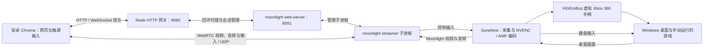

# 云游戏DEMO

Windows 11 主机运行游戏，安卓手机用 Chrome 打开主机的 HTTP 网页，即可接收实时画面、声音，并通过触屏虚拟手柄操作。采集与硬件编码复用 Sunshine，浏览器串流复用 moonlight-web-stream，触屏手柄复用 Selkies Universal Touch Gamepad。

本项目面向**受信任内网、单主机、单玩家的桌面串流测试**。它不提供云实例调度、账户计费、游戏自动启动或桌面隔离。当前命名操作按钮针对 BeamNG.drive；基础桌面串流可用于其他支持键盘 / XInput 的程序。

## 目录

- [功能与验证范围](#功能与验证范围)
- [架构与连接生命周期](#架构与连接生命周期)
- [环境与固定依赖](#环境与固定依赖)
- [从零安装](#从零安装)
- [启动、使用与停止](#启动使用与停止)
- [视频参数与编码](#视频参数与编码)
- [触屏与游戏映射](#触屏与游戏映射)
- [实时延迟](#实时延迟)
- [源码目录](#源码目录)
- [配置与网络](#配置与网络)
- [接口参考](#接口参考)
- [二次开发](#二次开发)
- [测试与验收](#测试与验收)
- [排错](#排错)
- [更新、迁移与分发](#更新迁移与分发)
- [上游与许可证](#上游与许可证)

## 功能与验证范围

| 项目 | 当前实现 |
| --- | --- |
| 手机入口 | `http://<主机内网IP>:8080`，横屏触控，无需安装客户端或手机证书 |
| 主机编码器 | NVIDIA NVENC / AMD AMF，启动时自动识别或手动选择 |
| 编码格式 | H.265 Main 8-bit / AV1 Main 8-bit，SDR、4:2:0 |
| 视频预设 | 1280×720、1920×1080、2756×1268，各支持 30 / 60 / 120 FPS |
| 码率 | 自动推荐或分档滑动条，手动最高 300 Mbps |
| 输入 | 左摇杆、LT / RT 模拟踏板、可展开的 ABXY、13 个命名按钮 |
| 音频 | 接收串流音频；自动播放被阻止时显示“开启声音” |
| 统计 | 实际接收编码、分辨率、FPS；每秒更新视频延迟估算及明细 |
| 会话 | 单玩家互斥、心跳、切后台断开、超时回收、输入释放 |
| 公开界面 | 文字品牌“云游戏DEMO”，不包含私人 Logo 素材 |

NVIDIA RTX 5090 主机已测试 H.265 和 AV1；手机已确认画面和转向可用，1080P / 60 FPS 有实际会话验证。AMD 路径已实现，W7800 仍需实机验收。2756×1268、120 FPS 和 300 Mbps 是已配置并通过参数测试的选项，**不表示所有手机、游戏和网络都能持续达到这些目标**。

游戏映射于 2026-09-07 按本机 BeamNG.drive 0.39.4 核对，不是对未来游戏版本的自动适配。游戏版本、模组、用户改键和车型可能改变操作效果。

## 架构与连接生命周期



- `server.mjs` 提供网页、租约和信令代理，**不编码视频，也不转发 WebRTC 媒体包**。
- Sunshine 采集并硬件编码；`streamer.exe` 接收编码数据，桥接到浏览器。浏览器通过原生 `video` / `audio` 元素播放 WebRTC 轨道。
- 触屏组件提供合成手柄状态，由 `demo.js` 显式读取发送，不依赖 HTTP 页面上的物理 Gamepad API。实体蓝牙手柄、WebCodecs 和 Keyboard Lock 不在此 HTTP Demo 的保证范围内。
- Sunshine 专用应用为 `Desktop`，启动命令 `cmd` 为空。回收结束本 Demo 桌面会话、释放输入设备，不负责关闭用户手动启动的游戏。

连接步骤：

1. `Start-Demo.ps1` 选择编码器，调用 prepare 生成配置、修补上游模块，再由 bootstrap 启动服务、登录、自动配对和定位 Desktop 应用。
2. 网页检查 `/demo/status` 及所选 codec 的 WebRTC 接收能力，申请租约，取得随机 token。
3. 客户端每 800 ms 发送心跳，使用带 token 的 WebSocket 建立信令，协商 WebRTC。
4. 收到 `videoReady` 后注册编号 0 的手柄，每秒约 60 次采样输入，每秒采样一次视频统计。视频 120 FPS 不会自动将输入采样改为 120 Hz。
5. 断开、切后台和离开页面会释放输入并请求结束会话。主机每 500 ms 检查，超过 3500 ms 没有心跳即开始回收；完成回收还需要上游请求时间。
6. 回收确认 Sunshine 没有活动应用后才允许新玩家；失败会锁定会话入口并提示重启排查。前端建立连接超时为 25 秒。

## 环境与固定依赖

| 环境 | 要求 / 说明 |
| --- | --- |
| 主机 | Windows 11 x64，交互式桌面登录且解锁 |
| GPU / 驱动 | 支持所选编码的 NVIDIA / AMD GPU 和官方驱动；不能只凭显卡品牌判断 AV1 能力 |
| 显示输出 | 保持可采集的活动显示输出；项目没有安装虚拟显示器，也不负责无显示器运行 |
| 游戏 | 用户自行安装、启动、进入地图并置于前台；CPU / 内存按游戏场景准备 |
| Node.js | 22 或更新版本，`node.exe` 在 PATH 中 |
| 工具 | Windows PowerShell、系统 `curl.exe`；克隆项目需要 Git |
| 权限 | 安装 ViGEmBus 和创建防火墙规则需要管理员权限，安装脚本请求 UAC |
| 手机 | Android Chrome，需通过运行时能力检查并实际成功解码；横屏使用 |
| 网络 | 手机与主机可互访的内网，允许指定 UDP；访客 Wi-Fi / AP 隔离可能阻止互访 |

W7800 官方 AV1 能力资料与配置依据见[编码与延迟说明](docs/codecs-and-latency.md)。手机刷新率、浏览器接收能力、实际硬件解码和持续性能需要分别验收。

| 依赖 | 固定版本 / 来源 | 取得方式 |
| --- | --- | --- |
| Sunshine | `v2026.516.143833` | 官方 Windows AMD64 portable 包 |
| moonlight-web-stream | `v2.10.0` | 官方 Windows GNU 二进制包及同版本源码 |
| ViGEmBus | `v1.22.0` | 官方签名驱动安装程序 |
| Universal Touch Gamepad | Selkies，2026-09-07 取得 | 带本地修改的源码已在 `public/vendor/` |

URL 与 SHA-256 固定在 [`scripts/acquire.ps1`](scripts/acquire.ps1)。驱动安装还会检查 Authenticode 签名及发布者。Demo 根目录没有 npm 第三方依赖或前端打包步骤；普通界面和网关开发不需要 Rust、FFmpeg 或 Sunshine 的完整编译环境。

## 从零安装

命令在 **Windows PowerShell** 中运行。首次安装联网下载 GitHub Release，运行时内网串流不需要公网 STUN / TURN。后续命令均以项目根目录为当前目录。

### 1. 获取源码与检查工具

```powershell
git clone https://github.com/1CatAI/CloudGamingDemo.git
Set-Location CloudGamingDemo
node --version
git --version
Get-Command curl.exe
```

建议使用简短路径。不要把其他主机的 `local.json`、日志、证书和已配对 runtime 当作源码一起复制。

### 2. 下载并校验

```powershell
powershell -NoProfile -ExecutionPolicy Bypass -File .\scripts\acquire.ps1
if ($LASTEXITCODE -ne 0) { throw 'Dependency download failed.' }
```

脚本复用哈希正确的已下载文件。校验失败时不要跳过校验，应重新取得对应官方文件。

### 3. 解压到约定目录

```powershell
New-Item -ItemType Directory -Force -Path runtime, vendor, logs | Out-Null
Expand-Archive -LiteralPath .\downloads\sunshine.zip -DestinationPath .\runtime\sunshine -Force
Expand-Archive -LiteralPath .\downloads\moonlight-web.zip -DestinationPath .\runtime\moonlight -Force
Expand-Archive -LiteralPath .\downloads\moonlight-web-source.zip -DestinationPath .\vendor -Force

Test-Path .\runtime\sunshine\Sunshine\sunshine.exe
Test-Path .\runtime\moonlight\package\web-server.exe
Test-Path .\runtime\moonlight\package\streamer.exe
Test-Path .\runtime\moonlight\package\static\stream\index.js
Test-Path .\vendor\moonlight-web-stream-2.10.0\LICENSE
```

五项检查应全部返回 `True`。同版本源码也必须解压：prepare 会从中读取许可证，不能只解压两个可执行程序。

### 4. 驱动与防火墙

```powershell
powershell -NoProfile -ExecutionPolicy Bypass -File .\scripts\install-host.ps1
if ($LASTEXITCODE -ne 0) { throw 'Host installation failed.' }
Get-Content .\runtime\host-install-result.json
```

接受 UAC 后，脚本安装缺失的 ViGEmBus，并创建限于 `LocalSubnet` 的 TCP 8080 / UDP 40000–40010 规则。若 `rebootRequested` 为 `true`，先重启再测试输入。

### 5. 启动与检查

```powershell
powershell -NoProfile -ExecutionPolicy Bypass -File .\Start-Demo.ps1
Invoke-RestMethod http://127.0.0.1:8080/demo/status
```

首次自动配对发生在主机本地，启动通常更慢。状态应包含 `ready: true`、`busy: false`。手机访问脚本打印的有效内网 IP；有 VPN / 虚拟网卡时会打印多个地址，应选与手机同网段的物理网卡地址。

## 启动、使用与停止

```powershell
# 默认自动识别；同时存在 NVIDIA / AMD 时优先 NVIDIA
powershell -NoProfile -ExecutionPolicy Bypass -File .\Start-Demo.ps1

# 或明确选择编码器
powershell -NoProfile -ExecutionPolicy Bypass -File .\Start-Demo.ps1 -Encoder nvidia
powershell -NoProfile -ExecutionPolicy Bypass -File .\Start-Demo.ps1 -Encoder amd

# 停止本 Demo 记录并确认归属的进程
powershell -NoProfile -ExecutionPolicy Bypass -File .\Stop-Demo.ps1
```

上述启动命令为备选，不需要依次全运行。切换编码器前先停止 Demo；`auto` 只按显卡名称选择类型，不自动完成多 GPU 的适配器和显示输出绑定。

1. 手动启动游戏、进入地图。首次验收建议 720P / 30 FPS + 自动码率，再逐档增加。
2. 手机打开 `http://<主机内网IP>:8080`，横屏选择参数，点击“连接主机”。全屏和音频需要用户操作触发，不是网页加载后无交互自动播放。
3. 左摇杆转向，LT 刹车、RT 油门：向上滑增加、向下滑减小、松手归零。右上角“按键”展开底部 ABXY。
4. 修改尺寸、FPS、codec 或码率后要断开重连。选择保存在当前浏览器的当前来源，换 IP / 端口不会共用。
5. 点“断开”或切后台结束当前串流；结束后可重新连接。

停止脚本按 PID 和启动时间核对归属，不卸载驱动、不删除规则或凭据，也不退出游戏。项目未配置开机自启、Windows 服务或无人值守守护。

## 视频参数与编码

配置源：[`presets.js`](public/presets.js)、[`codecs.js`](public/codecs.js)、[`bitrate-slider.js`](public/bitrate-slider.js)。

| 预设 ID | 视频流尺寸 | FPS | 自动推荐视频码率 |
| --- | --- | --- | --- |
| `720p30` | 1280×720 | 30 | 6 Mbps |
| `720p60` | 1280×720 | 60 | 10 Mbps |
| `720p120` | 1280×720 | 120 | 20 Mbps |
| `1080p30` | 1920×1080 | 30 | 12 Mbps |
| `1080p60` | 1920×1080 | 60 | 20 Mbps |
| `1080p120` | 1920×1080 | 120 | 40 Mbps |
| `2756x1268p30` | 2756×1268 | 30 | 25 Mbps |
| `2756x1268p60` | 2756×1268 | 60 | 45 Mbps |
| `2756x1268p120` | 2756×1268 | 120 | 80 Mbps |

滑动条档位：**自动、4、6、10、15、20、25、50、75、100、150、200、250、300 Mbps**。自动值可以是未单列的推荐数值。代码内单位是 **kbps**，20 Mbps 写为 `20000`。滑动条整数是档位下标，必须经 `bitrateChoice()` 转换，不能直接作为码率发送。

- H.265 的 ID / MIME 为 `h265` / `video/h265`，AV1 为 `av1` / `video/av1`。仅请求 8-bit Main，HDR 和 H.264 回退关闭。
- 连接前检查 `RTCRtpReceiver.getCapabilities('video')`；连接后核对 `inbound-rtp` 对应 codec 的 MIME。实际编码不匹配会结束会话，不静默降级。
- 浏览器报告支持不等于证明硬件解码或目标性能，应结合解码信息、帧率、丢帧和手机实测。
- 视频流尺寸不等于游戏渲染分辨率。`dd_configuration_option=disabled`，脚本不切换 Windows 分辨率 / 刷新率；桌面可能被缩放，宽高比不同可能出现黑边或缩放效果。
- 120 FPS 是串流请求，不是设置手机面板 120 Hz，还受游戏、显示输出、采集、编码、解码影响。
- 300 Mbps 是视频码率上限配置，不是网络流量上限；音频、纠错和协议还有开销。高码率可能增加拥塞和延迟。

## 触屏与游戏映射

源文件为 [`public/beamng-controls.js`](public/beamng-controls.js)，详细版本依据见[游戏映射记录](docs/beamng-controls.md)。

| 操作 | 实际输入 | 行为 |
| --- | --- | --- |
| 转向 | 左摇杆 X | 连续模拟轴，组件同时提供左摇杆 Y |
| 刹车 / 油门 | LT / RT | 0–1 模拟轴，向上加大，松手归零 |
| 重置车辆 | D-pad 右 | 点按；任务中可能重启任务 |
| 修复 / 回溯 | D-pad 左 | 点按修复，按住回溯 |
| 切换视角 | Y | 点按 |
| 手刹 | B | 按住，松手释放 |
| 升挡 / 降挡 | A / X | 点按 |
| 游戏菜单 / 地图 | Start / Back | 点按 |
| 暂停 / 继续 | J | 点按 |
| 喇叭 | H | 按住 |
| 车灯 | N | 点按 |
| 点火 / 启动 | V | 点按或按住 |
| 变速模式 | Q | 点按 |

网页模拟 XInput / 键盘，**不调用游戏内部 API**。`GAME_ACTIONS.action` 是映射说明，实际发送由 `button` 或 `key` 决定，仅改 action 文本不会改变输入。

命名按钮与轴合并发送，可同时转向、油门和换挡。点按保持 140 ms，连续点按间有 35 ms 中立间隔。多指按住同一键时，最后一位持有者释放才抬键。失焦 / 调整窗口时清零输入；断开还取消点按队列和定时器。

键盘动作要求游戏在主机前台。用户 `.diff` 改键覆盖游戏默认值；无响应时先检查游戏设置、任务上下文与模组。

## 实时延迟

右上角为**主机采集到手机视频解码完成**的链路估算，点击展开明细：

```text
总视频延迟 ≈ 主机采集 / 编码 + 主机转发
           + (Sunshine ↔ 桥接 RTT + 桥接 ↔ 浏览器 RTT) / 2
           + 浏览器接收处理时间
```

[`public/latency.js`](public/latency.js) 使用累计计数器的相邻采样差值：`totalProcessingDelay` 差值除以 `framesDecoded` 差值，秒转毫秒。`totalDecodeTime` 用于解码明细，不重复加入已含解码的接收时间；缺失接收处理字段时使用同期 jitter buffer 平均延迟 + 解码平均延迟。

网络使用选中 ICE candidate pair 的 RTT，单向按 RTT / 2 估算。主机统计超过 3500 ms 失效；无新帧、计数器重置或字段缺失时不沿用旧总数，也不将缺失值当零。

此值不包含触控上行、游戏响应及渲染前等待、解码后显示队列和屏幕扫描，不是触摸到画面的完整端到端实测。字段依据与限制见[编码与延迟说明](docs/codecs-and-latency.md)。

## 源码目录

```text
.
├── Start-Demo.ps1                 编码器选择 → 准备 → 启动
├── Stop-Demo.ps1                  按 PID / 启动时间停止所属进程
├── server.mjs                    HTTP、静态文件、租约 API、信令代理
├── lib/
│   ├── session.mjs               单玩家租约、超时、回收故障锁定
│   └── upstream.mjs              上游请求、总超时、大小 / 中断处理
├── public/
│   ├── index.html                页面结构、文字品牌、按钮容器
│   ├── demo.css                  布局、横竖屏适配、触屏和滑动条样式
│   ├── demo.js                   Stream 生命周期、输入合并与统计
│   ├── presets.js                尺寸 / FPS / 推荐码率及参数校验
│   ├── bitrate-slider.js         码率档位与存储值转换
│   ├── codecs.js                 编码列表与浏览器能力判断
│   ├── beamng-controls.js        动作、多指持有、合并与释放
│   ├── latency.js                延迟计算
│   ├── vendor/universal-touch-gamepad.js  复用并修改的触屏组件
│   └── tests/                    浏览器定时器与触点复位测试页
├── scripts/
│   ├── acquire.ps1               固定版本下载与 SHA-256 校验
│   ├── install-host.ps1          驱动、签名、防火墙配置
│   ├── prepare.mjs               生成主机配置、修补浏览器模块
│   ├── patch-media.mjs           AV1 profile、统计时间戳补丁
│   ├── bootstrap.mjs             启动、认证、配对、记录进程
│   └── read-xinput.ps1           只读查看 Windows XInput
├── tests/                        Node 测试与 http-live.mjs
├── docs/                         映射、编码 / 延迟、bug 复查记录
├── package.json                  Node 版本与 start / test / check
├── THIRD_PARTY.md                来源、版本、许可证与本地修改
└── LICENSE                       GPL-3.0 许可证文本
```

以下内容由本机生成，Git 已忽略：

| 路径 | 用途 |
| --- | --- |
| `downloads/` | 官方压缩包、驱动安装程序 |
| `runtime/sunshine/Sunshine/` | Sunshine 二进制、demo 配置、证书与配对状态 |
| `runtime/moonlight/package/` | Moonlight 二进制、修补的 static、server 数据 |
| `runtime/processes.json` | 本 Demo PID 和启动时间 |
| `runtime/host-install-result.json` | 驱动 / 防火墙安装结果 |
| `vendor/moonlight-web-stream-2.10.0/` | 上游源代码参考，区别于已提交的 `public/vendor/` |
| `logs/` | 主机 / 网关日志与客户端统计报告 |
| `local.json` | 每台主机独立的参数、密码、令牌、配对 ID |

## 配置与网络

### 配置来源

`scripts/prepare.mjs` 每次启动重新生成 Sunshine / Moonlight 配置。长期改动应写入该脚本；仅修改 runtime 中的 `config.json` / `sunshine.conf` 会在下次准备时被覆盖。`local.json` 也不是完整的配置接口：固定路径和端口会重写，已有凭据与配对信息会保留。

| local.json 字段 | 含义 / 生成者 |
| --- | --- |
| `encoder` | `nvenc` / `amdvce`，启动参数确定 |
| `sunshineDir` / `gatewayDir` / `staticPath` | 相对项目根目录的路径，prepare 生成 |
| `sunshinePort` / `sunshineAdminPort` / `gatewayPort` | 48989 / 48990 / 8091，prepare 设置 |
| `sunshineUser` / `sunshinePassword` | 本机 Sunshine 管理凭据，首次 prepare 生成 |
| `gatewayUser` / `gatewayPassword` | 本机 Moonlight 用户凭据，首次 prepare 生成 |
| `gatewayToken` | bootstrap 登录后取得的管理会话令牌 |
| `hostId` / `appId` | bootstrap 定位的本机主机与 Desktop 应用 ID |

不要在问题报告或公开源码中放实际 local.json。`public/` 和上游 `static/` 是网页可读目录；**将文件写进 .gitignore 不会阻止 HTTP 服务读取 public 下的文件**。

### 端口

| 端点 | 绑定 / 范围 | 用途 |
| --- | --- | --- |
| TCP 8080 | `0.0.0.0`，防火墙限 LocalSubnet | 网页、会话 API、WebSocket 信令 |
| UDP 40000–40010 | WebRTC，防火墙限 LocalSubnet | 手机与 streamer 的媒体 / 数据连接 |
| TCP 8091 | `127.0.0.1` | Moonlight web-server API / 管理 |
| 基础端口 48989 | `127.0.0.1` | Sunshine 基础端口，其派生服务遵循 Sunshine 端口偏移 |
| HTTPS 48990 | `127.0.0.1` | Sunshine 管理 / 配对 |

Sunshine UPnP 关闭，Moonlight ICE servers 为空、网络类型限 `udp4`。本机管理使用 Sunshine 自签名证书，`lib/upstream.mjs` 仅对主机名恰为 `127.0.0.1` 的 HTTPS 请求放宽证书验证；不要将这套逻辑直接改成远程管理策略。

只有 Node 入口读取 `PORT` 环境变量，prepare / bootstrap 探活、启动 URL、安装防火墙及 live 测试仍固定 8080，**不能只改 PORT 就认为整套部署已换端口**。

### 浏览器存储

| Key | 值 |
| --- | --- |
| `beamng-demo-preset` | 预设 ID，保留早期名称兼容旧选择 |
| `cloud-demo-codec` | `h265` / `av1` |
| `cloud-demo-bitrate` | `auto` 或 kbps 字符串，不是滑动条下标 |
| `universalTouchGamepad_currentProfile` | 触屏 profile，本 Demo 加载时指定 racing |

### 部署边界

网页没有用户登录，同一允许网段内可访问入口的设备可申请控制桌面。租约 token 区分会话，不代替用户认证；Origin 检查也不是局域网访问控制。HTTP 页面和信令未受 HTTPS 保护，不要直接把这套配置映射到公网。

扩展公网服务需要另行实现认证授权、HTTPS / WSS、Origin / 代理适配、ICE / TURN、限流、审计和桌面隔离，当前都未完成。公开代码不等于公开运行中的桌面服务。

## 接口参考

接口实现在 [`server.mjs`](server.mjs)。JSON 请求体必须是对象，上限 4096 字节；响应默认禁用缓存。存在 Origin 时，必须匹配当前 `http://Host`。

| 方法 / 路径 | 请求 | 响应 / 行为 |
| --- | --- | --- |
| `GET /demo/status` | 无 | `ready, error, busy, encoder, hostId, appId, width, height, fps`；最后三个是历史默认值，不能作为当前视频实测 |
| `POST /demo/session` | `{}` | `token, hostId, appId`；主机不可用 503，占用 409 |
| `POST /demo/heartbeat` | `{"token":"<会话token>"}` | `{"ok":true}`；无效 / 过期 409 |
| `POST /demo/end` | 同上 | 回收后 `{"ok":true}`；旧 token 409，回收失败 500 |
| `POST /demo/report` | token 加统计字段 | 去掉 token 后写主机日志；无效会话 403 |
| `GET /api/authenticate`、`/api/user`、`/api/role`、`/api/host`、`/api/apps` | 上游查询参数 | 白名单转发，Node 注入本机管理 Bearer |
| `WS /api/host/stream?demo_token=…` | 当前租约 token | 验证后代理信令；移除查询 token、注入 Bearer；无效 403、重复信令 409 |
| `GET/HEAD /`、`/demo.js` 等 | 公开路径 | 从 public 读取允许扩展名的静态文件 |
| `GET/HEAD /upstream/*` | 模块路径 | 映射到 local.staticPath，供浏览器 import |

没有通用 `/api/*` 写代理，`/api/login` 不向手机开放。信令协议由 Moonlight 提供，类型在运行时 `static/api_bindings.js`，对应上游 `common/` 和 `web/stream/`。新增操作先对照现有类型，不自行猜测协议。

`lib/upstream.mjs` 默认总超时 15 秒，最大响应 2 MiB，并处理流中断。`createDemoServer({local, root, requestUpstream, log})` 可注入假上游，返回 `{server, lease, shutdown}`，是网关测试的主要边界。

## 二次开发

### 开发循环

1. 完成下载、解压，至少运行一次 `node scripts/prepare.mjs nvidia` 或 `amd`。单独 prepare 不启动服务，但会生成本机配置、凭据并修补模块。
2. 修改 `public/` 的 HTML / CSS / JS 后刷新页面即可，没有构建器、HMR 或 Service Worker；模块有缓存时强制刷新。
3. 修改 Node、启动脚本或生成配置后，停止 Demo 再用 Start-Demo 启动。
4. `npm.cmd start` 只启动 server.mjs，不下载依赖、不启动 Sunshine / Moonlight、不自动配对；不能与占用 8080 的现有 Demo 并行运行。
5. 提交前执行相关检查，并检查 git status 不含凭据、运行时和个人素材。

### 修改位置速查

| 需求 | 位置与约束 |
| --- | --- |
| 布局 / 品牌 | index.html、demo.css；保留 demo.js 使用的 ID。默认无图片 Logo，新素材需自行确认公开授权 |
| 增加尺寸 / FPS | presets.js 的 STREAM_PRESETS；自定义尺寸用 `videoSize:'custom'`、width / height；同步参数测试和文档 |
| 推荐码率 / 上限 | presets.js 中 bitrate / MAX_BITRATE_KBPS；demo.js permissions 引用该上限，仍需验证上游及硬件限制 |
| 滑动条档位 | bitrate-slider.js 的 BITRATE_STEPS，首项保留 auto，单位 kbps；JS 自动生成最大下标与刻度，HTML 初值同步 |
| 新增命名动作 | beamng-controls.js 的 GAME_ACTIONS；选现有 left / right / driving 分组及 tap / hold |
| 摇杆 / 踏板 | public/vendor 组件的 profiles.racing、模拟轴处理和 demo.css；保留触点复位 |
| 其他游戏 | 修改动作与游戏内绑定，保留 XInput 轴路径；游戏仍手动启动 |
| 新编码 | codecs.js、demo.js permissions / settings、prepare / patch-media profile 限制和 Sunshine 配置；只加下拉选项不够 |
| 心跳 / 回收 | session.mjs、server watchdog、demo.js 心跳周期和超时，前后端一起核对 |
| 改端口 | server、prepare 两套配置及探活、bootstrap 探活、Start-Demo URL、install-host 规则、http-live 测试 |
| 延迟算法 | latency.js、patch-media、demo.js 统计映射及界面说明，避免重复计入解码 |
| 多用户 | 重新设计租约、桌面隔离、输入归属和调度；删除 busy 判断不能实现多用户隔离 |

### 新增按钮示例

可在 GAME_ACTIONS 数组增加一项，例如为同一视角动作提供额外入口：

```js
{ id:'cameraExtra', label:'视角', group:'right',
  button:'BUTTON_Y', mode:'tap', action:'switch_camera_next' }
```

id 必须唯一，button 必须是 StreamControllerButton 中存在的成员。键盘动作使用 Windows 虚拟键码 `key`，如 J 为 `0x4a`。`clearDriving:true` 会在激活动作时清零转向 / 踏板，适用于重置类动作。

不要绕开 GameActionInput 散布定时器或直接覆盖整份手柄状态；它负责多指持有、点按队列、键盘释放和断开清理。

### 触屏与 Stream 扩展点

- `window.demoTouchState()`：获取合成手柄 axes、buttons、connected。
- `window.demoResetTouch()`：复位状态、触点与显示，失焦 / 断开 / 窗口变化时调用。
- `TOUCH_GAMEPAD_SETUP` / `TOUCH_GAMEPAD_VISIBILITY`：同来源 postMessage 初始化或显示触屏层。
- Stream 从 `/upstream/stream/index.js` 导入，mount 后等 videoReady 再输入；结束涉及 stop、transport / WS close、renderer / audio cleanup、unmount。
- generation 和实例一致性检查防止旧异步回调影响新会话，修改生命周期时需保留。

### 上游模块与补丁

`runtime/moonlight/package/static/` 是下载产物，不要将手改运行时当作最终改动。修改 `scripts/prepare.mjs` / `scripts/patch-media.mjs` 中可重放的补丁，并在干净的固定版本解压内容上验证。

当前补丁涵盖：租约 token、控制器槽位注册 / 注销、ABXY 标准映射、WebRTC 编码能力判断、通知图标路径、H.265 / AV1 profile、主机统计接收时间戳。详见 [THIRD_PARTY.md](THIRD_PARTY.md)。

prepare 的部分补丁有文件头标记，已经标记的文件会跳过该组补丁。修改补丁定义后，应停服务，用原始包恢复对应 static 文件，再运行 prepare；仅重启不保证新补丁执行。`Unsupported upstream contents` / `Unexpected upstream file` 表示基线不匹配，应对照源码移植，不能删掉校验强行继续。

### 需要编译上游时

普通 Demo 开发使用官方二进制。仅当修改 streamer / web-server 或上游 TypeScript 时才需进入上游构建；不要在 Demo 根目录执行上游 npm / Cargo 命令。

- [v2.10.0 构建说明](https://github.com/MrCreativ3001/moonlight-web-stream/tree/v2.10.0#building)
- [同版本 CI](https://github.com/MrCreativ3001/moonlight-web-stream/blob/v2.10.0/.github/workflows/ci.yml)
- [工具链文件](https://github.com/MrCreativ3001/moonlight-web-stream/blob/v2.10.0/rust-toolchain.toml)

该版本指定 Rust `nightly-2026-02-13`，Windows 目标为 `x86_64-pc-windows-gnu`。上游 CI 使用 Ubuntu、Node 24、Rust / Cargo Cross；前端执行 npm ci 和 npm run build，后者也通过 Cargo 生成 bindings，并非纯 TypeScript 编译。

使用独立 Git checkout，保留子模块和 lockfile：

```text
git clone --branch v2.10.0 --recurse-submodules https://github.com/MrCreativ3001/moonlight-web-stream.git
```

按同版本 CI 配齐 C / C++、加密库和交叉编译环境。前端产物为 dist，release 包使用 static。停 Demo 后将完整 web-server.exe、streamer.exe、配套运行库及 static 部署到约定 package 目录，再重跑补丁及验收。这里未验证 Windows 本机编译全链路，上述是构建入口，不是本项目提供的一键编译脚本。

## 测试与验收

### 自动测试

```powershell
npm.cmd run check
npm.cmd test
# 完整回归的等价命令
node --test tests/*.test.mjs
```

gamepad.test.mjs、beamng-controls.test.mjs 和 presets.test.mjs 会导入或读取 runtime 中已修补的上游模块。刚克隆就报模块缺失时，先完成下载、解压和 prepare；npm install 不能替代这些步骤。

未准备 runtime 时，可先执行独立逻辑测试：

```powershell
node --test tests/session.test.mjs tests/upstream.test.mjs tests/server.test.mjs tests/bitrate-slider.test.mjs tests/codecs.test.mjs tests/latency.test.mjs tests/pedal.test.mjs tests/client-lifecycle.test.mjs
```

| 文件 / 页面 | 覆盖 |
| --- | --- |
| session、server、upstream 测试 | 租约、异常请求、主机离线、回收失败、中断与总超时 |
| client-lifecycle 测试 | 取消期间晚到租约、旧会话回调隔离 |
| gamepad、pedal、beamng-controls 测试 | 槽位、ABXY、轴、踏板方向、多指、重复点按、清理 |
| presets、bitrate-slider、codecs 测试 | 参数、码率存储转换、编码能力 |
| latency 测试 | 区间平均、缺失 / 重置、RTT、解码不重复累计 |
| `/tests/timers.html` | 浏览器原生计时器和释放，点击“运行测试” |
| `/tests/touch.html` | 浏览器触点复位与新旧手指接管，点击“运行触屏测试” |

两个浏览器测试页不连接游戏。已有完整回归基线为 38 项通过；Node 模拟测试不能代替手机触控、硬件编解码和长时间串流验收。

### 真实主机检查

```powershell
Invoke-RestMethod http://127.0.0.1:8080/demo/status
powershell -NoProfile -ExecutionPolicy Bypass -File .\scripts\read-xinput.ps1 -Seconds 10
node tests/http-live.mjs
```

read-xinput 只读 XInput 状态。http-live 访问真实主机：空闲时申请测试租约并等待心跳超时回收，已有玩家时跳过会话测试；它不验证媒体和游戏动作。

实际验收至少包括：

1. 目标手机分别连接 H.265 / AV1，实际 codec 正确，解码帧数增长，尺寸 / FPS 符合目标。
2. 转向 + 油门、多踏板、换挡 / 手刹 / 喇叭组合、快速连点；重置后新触点可重新接管。
3. 断开、刷新、切后台、断网恢复、第二设备竞争会话；按键归零、旧会话回收。
4. 各档长时间观察帧率、丢帧、延迟和温度，特别验证 W7800、2756×1268 / 120 FPS 与高码率。

## 排错

| 日志 / 文件 | 内容 |
| --- | --- |
| `logs/sunshine.log` | 采集、NVENC / AMF 编码器、显示输出和会话 |
| `logs/moonlight.log` | 桥接、WebRTC 和上游连接 |
| `logs/http-console.log` | Node、会话回收、CLIENT 视频 / 延迟报告 |
| `logs/sunshine-console.log` / `logs/gateway-console.log` | 子进程 stdout / stderr |
| `logs/vigembus-install.log` | 驱动安装 |
| `runtime/host-install-result.json` | 驱动、重启提示、防火墙结果 |

```powershell
Get-Content .\logs\sunshine.log -Tail 80
Get-Content .\logs\moonlight.log -Tail 80
Get-Content .\logs\http-console.log -Tail 80
Get-NetFirewallRule -Name 'BeamNGDemo-HTTP','BeamNGDemo-WebRTC'
```

防火墙规则保留初版 BeamNGDemo-* 名称以识别已有安装。日志可能含 user agent、页面地址和解码信息，分享前需脱敏。

| 症状 | 优先检查 |
| --- | --- |
| 手机打不开页面 | localhost、实际内网 IP、同网段、AP 隔离、TCP 8080、规则绑定的 node.exe 路径 |
| 页面可开但超时 / 无画面 | 桌面可采集状态、Moonlight / streamer 日志、UDP 40000–40010、VPN / 多网卡、codec |
| Extract official archives before preparation | 解压目录层级，参考五项 Test-Path |
| ERR_MODULE_NOT_FOUND 指向 runtime | 缺少 static 或 prepare 未执行；安装 npm 依赖不能解决 |
| Unsupported upstream contents | 固定版本 / 补丁基线不符，恢复原文件后移植补丁 |
| 主机未就绪 / 配对失败 | 服务、日志、凭据状态，停止后重启；不要运行中删配对数据 |
| EADDRINUSE | 端口被其他进程或重复实例占用 |
| 浏览器不支持所选编码 | 检查 WebRTC 能力而非 MP4 播放，尝试另一支持的编码重连 |
| 有画面无手柄 | ViGEmBus 状态、是否需重启、XInput、游戏绑定与焦点 |
| 喇叭 / 暂停不工作 | 键盘动作要求游戏前台，检查用户改键 / 模组 |
| 使用中 / 回收失败 | 等正常回收；持续故障时停服务再启动，查看 WATCHDOG / 取消日志 |
| 无声音 | 开启声音按钮、手机音量、主机音频输出和捕获日志 |
| 达不到 120 FPS | 显示与游戏帧率、采集 / 编码负载、解码 / 刷新率、Wi-Fi；降码率 / FPS 对照 |
| 延迟采样 / 统计不全 | 新帧、浏览器字段、主机时间戳补丁、统计有效期 |
| 移动目录 / 升级 Node 后不可用 | 重新 prepare，检查绝对路径及规则是否指向旧程序 |

install-host 仅在规则不存在时创建规则，**不更新已有规则的程序路径**。移动项目、替换 Node 或改端口后，应核对并更新规则，不能只重复运行安装脚本。

## 更新、迁移与分发

- 同主机更新源码：先停 Demo、更新、再启动；保留 local.json 和配对 runtime。不要在会话中覆盖二进制或配置。
- 换主机：重新按从零安装准备自己的账户、证书和配对，不复制管理令牌；移动目录后核对防火墙路径。
- 升级上游：同步 acquire 的版本 / URL / SHA-256、prepare 的路径和补丁、THIRD_PARTY、README 和测试；不要只替换一个 exe 或跳过匹配。
- 分发源码：包括本项目、LICENSE、THIRD_PARTY 和补丁 / 构建说明；不含游戏本体、私人品牌素材、管理凭据、日志或已配对 runtime。
- 分发运行包：需另外处理第三方二进制许可证及对应源码义务；下载脚本不等于完成自定义发行包的所有许可要求。
- 重置安装：先停服务、备份必要的本机数据。卸载驱动、删除配对和移除防火墙是独立操作，Stop-Demo 不执行。

仓库没有自动发布流水线、升级器或跨主机迁移工具。问题报告建议提供提交版本、Windows / GPU / 驱动、手机 / Android / Chrome、预设和 codec、复现步骤、脱敏日志及实际统计。

## 上游与许可证

| 项目 | 作用 | 许可证 |
| --- | --- | --- |
| [Sunshine](https://github.com/LizardByte/Sunshine) | 采集、硬件编码、输入注入 | GPL-3.0 |
| [moonlight-web-stream](https://github.com/MrCreativ3001/moonlight-web-stream) | Moonlight → WebRTC 桥接与浏览器模块 | GPL-3.0-or-later，见上游声明 |
| [Selkies Touch Gamepad](https://github.com/selkies-project/selkies/tree/main/addons/universal-touch-gamepad) | 触屏手柄源码 | MPL-2.0，保留文件许可头 |
| [ViGEmBus](https://github.com/nefarius/ViGEmBus) | Windows 虚拟 Xbox 控制器总线 | BSD-3-Clause，见上游声明 |

根目录提供 [LICENSE](LICENSE)。组件许可与归属分别保留，不要统一替换第三方文件的许可头。版本、使用方式和修改记录见 [THIRD_PARTY.md](THIRD_PARTY.md)。
